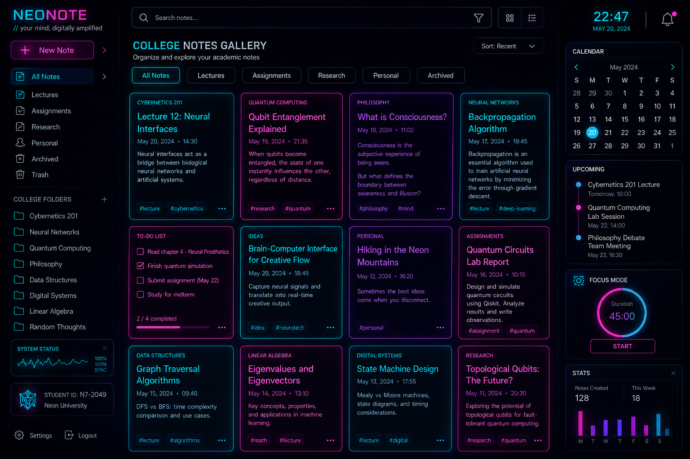

# SYS.NET.ID: DILEEP // Cyberpunk Portfolio

> **STATUS: SECURE // CLEARANCE: LEVEL_01 // ACCESS: GRANTED**

Welcome to my personal portfolio. This project is a highly immersive, interactive "Hacker Terminal" and Cyberpunk-themed web experience built entirely from scratch. It abandons traditional, boring web layouts in favor of 3D geometry, CRT scanlines, neon glitches, and terminal-based interactions.

 <!-- *Placeholder for your actual portfolio screenshot* -->

## ⚡ Tech Stack
* **Core:** Vanilla HTML5, CSS3, JavaScript (ES6+)
* **Styling:** Custom CSS Custom Properties (Variables), Flexbox, CSS Grid, 3D Transforms (`perspective`, `rotateY`, `translateZ`)
* **Animations:** Keyframes (Glitch, CRT Flicker, Scanner Beams), Intersection Observer API for scroll reveals
* **Data Transmission:** AJAX / Fetch API integrated with Formspree for the terminal contact form
* **Dependencies:** None. Zero external frameworks. 100% bespoke code.

## 🚀 Key Features

* **Biometric Clearance Badge (Education):** A fully 3D-perspected, holographic ID card. Features a `rotateY` tilt effect and an animated laser scanner beam on hover to display academic credentials.
* **Corporate Contracts Bounty Board (Experience):** An asymmetrical grid of digital dossiers. Experience cards glitch upon interaction to reveal "Mission Debrief" bullet points.
* **Cyberpunk HUD Datapads (Projects):** Projects are displayed as drone/satellite data feeds with heavy sepia/grayscale filters, scanline overlays, and mechanical targeting corners that snap into full color when engaged.
* **Dynamic Radar Chart (Skills):** A custom HTML5 Canvas radar chart that maps out technical proficiencies, animating outward when scrolled into view.
* **Decryption Text Effects:** Bio text initially loads as scrambled hexadecimal characters (`0xA4`, `0x8F`) and rapidly decrypts into English when the user interacts with it.
* **Terminal Contact Form:** A functional bash-style terminal prompt for sending emails. It processes submissions asynchronously and provides real-time "Transmission Successful" or "Network Failure" feedback directly inside the terminal interface without redirecting the page.
* **Global Theming:** Custom `::-webkit-scrollbar`, custom `::selection` highlight colors, and a persistent CRT scanline overlay across the entire DOM.

## 🛠️ Deployment & Usage

Because this project is built entirely with frontend web standards, no build step or package manager is required.

1. **Clone the repository:**
   ```bash
   git clone https://github.com/Dileep-kumarc/cyberpunk-portfolio.git
   ```
2. **Access the Node:**
   Open `index.html` in any modern web browser (Chrome, Firefox, Edge, Safari).

## 📡 Transmission Contact
* **GitHub:** [@Dileep-kumarc](https://github.com/Dileep-kumarc)
* **LinkedIn:** [Dileep Kumar C](https://www.linkedin.com/in/dileepkumar-java/)

---
*END_OF_TRANSMISSION // 0x2026 // CRAFTED BY DILEEP KUMAR C.*
